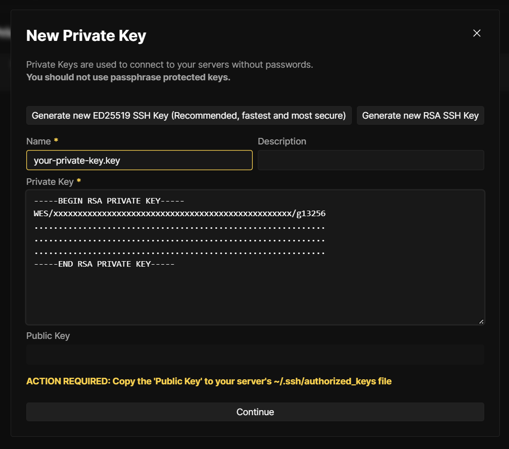
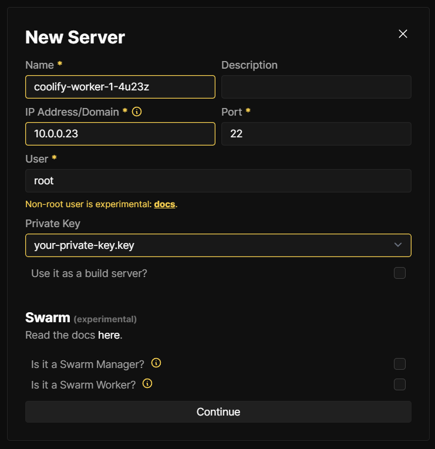
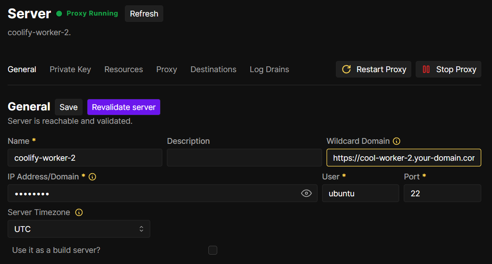

# Coolify Deployment on OCI Free Tier

This Terraform project deploys a Coolify instance along with some worker nodes in the Oracle Cloud Infrastructure (OCI) Free Tier. Coolify is an open-source platform to deploy and manage applications with ease.

## About Coolify
Coolify is an open-source & self-hostable alternative to Heroku / Netlify / Vercel / etc.

It helps you manage your servers, applications, and databases on your own hardware; you only need an SSH connection. You can manage VPS, Bare Metal, Raspberry PIs, and anything else.

For more information, take a look at his landing page at [coolify.io](https://coolify.io).

## Prerequisites

Before deploying, ensure you have the following:
- Oracle Cloud Infrastructure (OCI) account with Free Tier resources available.
- SSH public key for instance access.

## Deploy

## Add workers to Coolify

First of all, you may find your `localhost` server is not reachable, to solve that you only need to update the user to `ubuntu`.

Also, you might need to add your private key on your `Keys & Tokens` section in order to connect to the worker instances.

#### Steps to add worker servers
- Go to Servers > Add
    - Name: The name of the server
    - IP Address/Domain: If you want to use a wildcard domain use the private instance IP, otherwise take the public one.
    - User: ubuntu

    

- Check your proxy is running and you are good to go.

    

- Your server screen now should look like this.

    

## Project Structure

- `main.tf`: Contains the configuration for Coolify instances and workers.
- `variables.tf`: Specifies the required input variables like compartment ID, instance shape, memory, and OCPU count.
- `outputs.tf`: Displays the dashboard and worker instance IPs upon deployment.
- `bin/coolify-main.sh`: Bash script to install Coolify on the main instance.
- `bin/coolify-worker.sh`: Bash script to install necessary dependencies on worker instances.

## Terraform Variables

The following variables must be defined in `variables.tf` or passed during `terraform apply`:

- `ssh_authorized_keys`: Your SSH public key to access the instances.
- `compartment_id`: OCI compartment where instances will be deployed.
- `num_worker_instances`: Number of Coolify worker instances to deploy.
- `availability_domain_main`: Availability domains to deploy the main instance.
- `availability_domain_workers`: Availability domains to deploy the worker instances.
- `instance_shape`: The shape (e.g., VM.Standard.E2.1.Micro) to be used for the instances.
- `memory_in_gbs`: The memory allocated to each instance.
- `ocpus`: Number of OCPUs allocated to each instance.